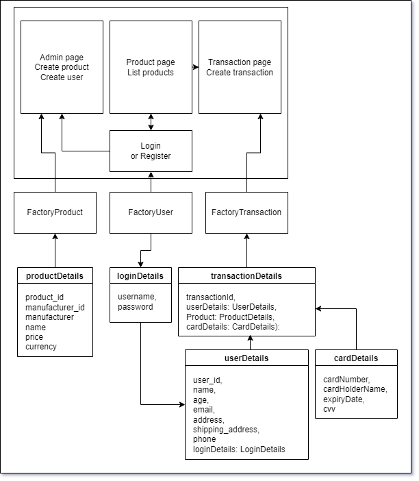
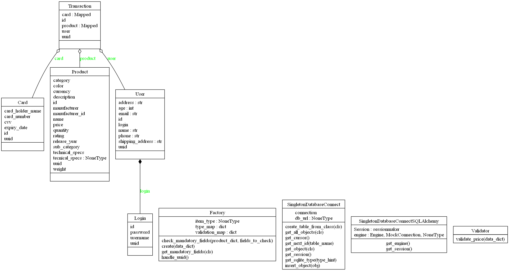
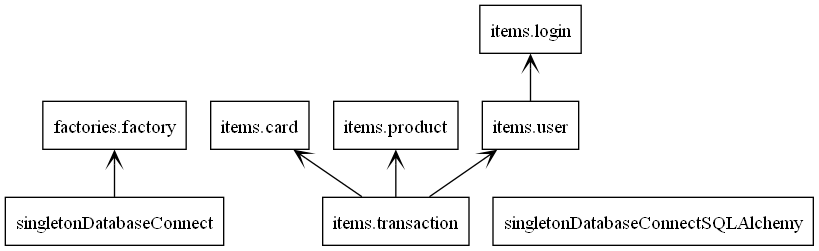

# Uge5: Factory and Singleton

## View `notebooks` for code runs
This includes description of solution

[Coderun](notebooks/coderun.ipynb)

## View code used
This is the code used for the project. See [Diagrams](#diagrams) for structure

[Classes](code/items/)
[Factory](code/factories/factory.py)
[Singleton_sqlite3](code/singletonDatabaseConnect.py)
[Singleton_sqlalchemy](code/singletonDatabaseConnectSQLAlchemy.py)
[Tests](code/newTest.py)

## Installation

1. Create environment:
    ```
    python -m venv .venv
    ```

2. Activate environment:
    ```
    .venv\Scripts\activate
    ```

3. Install requirements:
    ```
    pip install -r requirements.txt
    ```

4. Run the tests
make sure you're in directory with the tests: /code/
    ```
    python -m unittest newTest.py
    ```

## Diagrams

### First draft diagram
Original and first draft of the project. Here i imagined the code could be used in a front-end product-sale-website.
Initially I had multiple factories. Now I just have 1 for all the types.


### Pyreverse diagrams
Here are the pyreverse generated diagrams

Class diagram


Packages diagram

